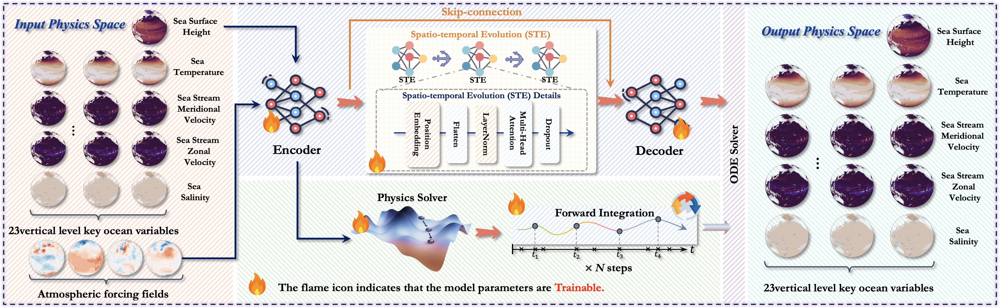

# NeuralOGCM: Differentiable Ocean Modeling with Learnable Physics

[](https://arxiv.org/abs/2502.00338)
[](https://pytorch.org/)
[](LICENSE)

<p align="center" width="100%">
  
</p>


This repository contains the official implementation of the paper **"NeuralOGCM: Differentiable Ocean Modeling with Learnable Physics"**.

**NeuralOGCM** is a novel hybrid ocean general circulation model (OGCM) that bridges the gap between traditional numerical models and pure AI approaches. By integrating a **Differentiable Physics Core** with a **Deep Learning Corrector**, it achieves high-fidelity simulation with the speed of AI models while maintaining long-term physical consistency.


## News 🚀🚀🚀
- `2025/12/13`: We open the Model weights.


- `2025/12/09`: We will release NeuralOGCM, to the best of our knowledge, is the first hybrid ocean general circulation model to integrate differentiable physics programming with deep learning.


## 🌟 Key Features

* **Hybrid Architecture:** Combines a differentiable dynamical solver (based on primitive equations) with a Spatio-temporal Evolution (STE) neural network.
* **Learnable Physics:** Key physical parameters, such as diffusion coefficients ($\nu$), are optimized end-to-end from data, allowing the model to autonomously tune its physics core.
* **High Performance:** Significantly outperforms pure AI baselines (e.g., FourCastNet, SimVP) in accuracy and stability while being orders of magnitude faster than traditional GCMs.
* **Distributed Training:** Built on PyTorch DDP (Distributed Data Parallel) for efficient training on multi-GPU clusters.

## 📂 Repository Structure

```text
/NeuralOGCM_ocean/clean_code/
├── checkpoints/       # Saved model weights
├── logs/              # Training logs
├── model/             # Model definitions
│   ├── ocean_clean.py # NeuralOGCM model
│   ├── UNet.py        # Baseline: U-Net
│   ├── ConvLSTM.py    # Baseline: ConvLSTM
│   ├── SimVP.py       # Baseline: SimVP
│   └── Fourcastnet.py # Baseline: FourCastNet
├── Dataloader.py      # Data loading and preprocessing logic
├── train.py           # Unified distributed training script
└── untils/            # Utility functions
```

## 🛠️ Installation

1. **Clone the repository:**

   ```
   git clone [https://github.com/your_username/NeuralOGCM.git](https://github.com/your_username/NeuralOGCM.git)
   cd NeuralOGCM/clean_code
   ```

2. Environment Setup:
   The code requires Python 3.8+ and PyTorch. We recommend PyTorch 1.10+ to support bfloat16 mixed precision and dist.ReduceOp.AVG.
   ```
   pip install torch numpy h5py tqdm
   ```

## 💾 Data Preparation

The model is trained on a combination of **GLORYS12** (Ocean variables) and **ERA5** (Atmospheric forcing).

- **Spatial Resolution:** $1.5^\circ$ ($120 \times 240$ grid).
- **Temporal Resolution:** Daily mean (24h).
- **Variables:** 97 channels total (93 ocean levels/variables + 4 atmospheric forcing).

Expected Directory Structure:

Update the root_path in Dataloader.py or pass it via command line arguments.


```
/path/to/dataset/
├── train/              # Training .h5 files (1993-2017)
├── valid/              # Validation .h5 files (2018-2019)
├── test/               # Testing .h5 files (2020)
├── climate_mean_s_t_ssh.npy  # Climatology statistics
├── mean_s_t_ssh.npy          # Global mean
└── std_s_t_ssh.npy           # Global std
```
## 🚀 Usage

The `train.py` script serves as the unified entry point for training NeuralOGCM and baselines. It utilizes `torch.distributed.launch`.

### 1. Train NeuralOGCM

In the codebase, the proposed NeuralOGCM model.

Bash
```
# Run on a single node with 8 GPUs
python -m torch.distributed.launch --nproc_per_node=8 train.py \
    --model NeuralOGCM \
    --data_root /path/to/your/data \
    --batch_size 2 \
    --epochs 50 \
    --lr 5e-4
```

### 2. Train Baselines

You can train comparison models by changing the `--model` argument:

- **FourCastNet:**

  Bash
  ```
  python -m torch.distributed.launch --nproc_per_node=8 train.py \
      --model fourcastnet \
      --fourcastnet_embed_dim 256
  ```

- **SimVP:**

  Bash
  ```
  python -m torch.distributed.launch --nproc_per_node=8 train.py \
      --model simvp \
      --simvp_hid_s 64
  ```

### Key Arguments

- `--model`: Select architecture (`NeuralOGCM`, `unet`, `convlstm`, `simvp`, `fourcastnet`).
- `--resume`: Path to a checkpoint (`.pth`) to resume training.
- `--batch_size`: Batch size per GPU (default: 2, effective batch size 16 on 8 GPUs).

## 📜 Citation

If you find this code useful for your research, please cite our paper:

```
@article{wu2025neuralogcm,
  title={NeuralOGCM: Differentiable Ocean Modeling with Learnable Physics},
  author={Wu, Hao and Gao, Yuan and Xu, Fan and Liu, Guangliang and Liang, Yuxuan and Huang, Xiaomeng},
  journal={Preprint},
  year={2025}
}
```

## 📄 License

This project is licensed under the MIT License.
